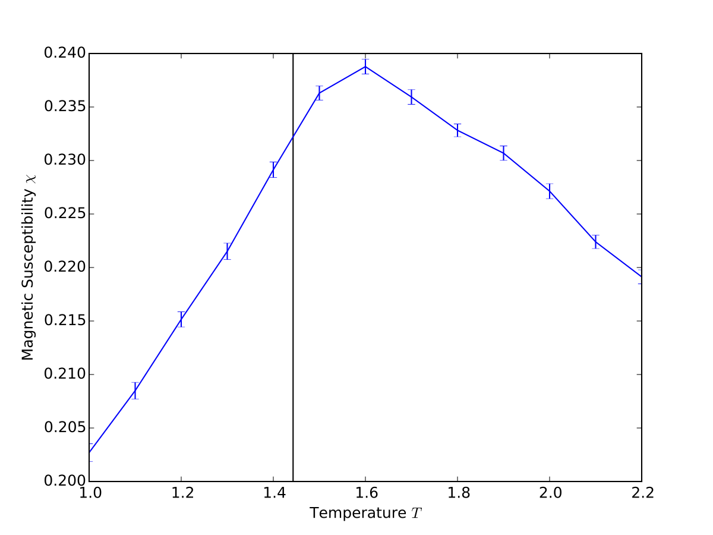
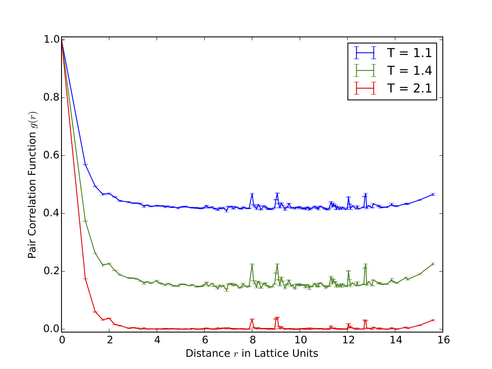

# HowTo: O(n) spin simulation

This document describes how to use the ALPS C++ Libraries to simulate a classical O(n) spin model using local updates.
It also aims to show how to:

 * make use of alps::mcbase to develop a monte carlo simulation
 * use it's `update()` to implement your own model
 * add observables to the model
 * use the `measurements()` method to calculate and store measurements
 * run a simulation developed using the described techniques

It is meant as a starting point to write your own spin simulations using ALPS in C++. 
The inline code examples are shortened for readability and may or may not compile.
Refer to the source files for a runnable version.
 
### Running a simulation
First let's consider the basic structure of the main function needed to run our finished simulation in the end.
This program reads parameters from a text input file with the structure `parameter=value`.

```C++ hl_lines="13 14"
/* my_mc_main.cpp */

#include "my_mc_sim.hpp"
#include <alps/parseargs.hpp>
#include <alps/stop_callback.hpp>

int main(int argc, char *argv[]) {
    // get commandline options and parameters
    alps::parseargs options(argc, argv);
    parameters = alps::parameters_type< sim_type >::type(options.input_file);

    // create and run the simulation
    my_mc_sim sim(parameters);
    sim.run(alps::stop_callback(options.timelimit));

    // save the results in a hdf5 archive
    alps::hdf5::archive ar(options.output_file, "w");
    ar["/parameters"] << parameters;
    ar["/simulation/results"] << results;

    return EXIT_SUCCESS;
}
```
It is not very big and the actual running of the simulation is all handled in the two highlighted lines.
With just a few lines of code it can be made to take input files of different formats and to pick up from where it left if it was interrupted previously.

## A basic MC simulation

### Simulation class

The simulation will be a derivate of alps::mcbase which already implements all the common tasks of Monte Carlo simulations.

 * it can easily be initialized from a parameter file
 * it automatically calls the user implemented update step to do system sweeps
 * for every sweep it performs user implemented measurements
 * it handles storing results and parameters to files.
 * it can write out an intermediate state from which the simulation can be continued later
 * it prints out progress information.

The functions specific to a certain model are exposed as pure virtual functions and must be implemented when writing a simulation.
Take a look at an empty definition of a simulation class which you might use as a template if you want to develop a simulation from scratch.

```C++ hl_lines="11 12"
/* my_mc_sim.hpp */

#include <alps/mcbase.hpp>
#include <alps/hdf5/archive.hpp>

class ALPS_DECL my_mc_sim : public alps::mcbase {

public:
    my_mc_sim(parameters_type const & parms, std::size_t seed_offset = 0);

    virtual void update(); // this will execute the MC update
    virtual void measure(); // this will perform measurements
    virtual double fraction_completed() const; // this is used for progress output

    using alps::mcbase::save;
    virtual void save(alps::hdf5::archive & ar) const; // save intermediate state

    using alps::mcbase::load;
    virtual void load(alps::hdf5::archive & ar); // load intermediate state to run from there.

private:
    // internal data
};
```

The highlighted functions `update()` and `measure()` define the behaviour of the model and they are called by mcbase's `run()` method each simulation step.

The `save` and `load` functions can be used to store and load intermediate state of the run, allowing interrupted simulations to take up from where they left.
To enable that functionality those functions have to be extended with any data members that contribute to the state of the simulation.
An example in a spin simulation would be the data structure that holds the system's spins.

the `fraction_completed` method should return a floating point number between 0.0 and 1.0 according to how far the simulation has progressed.

In addition to those methods the base class has a number of data members to make our life easier.

## Implementing the model
The model used in this example is the O(N) model, a generalization of the Ising Model to spins of N dimensions.
Special cases include the XY (N = 2) and Heisenberg (N = 3) models.
The generalization is achieved in this example by templating the simulation class on the dimension N.

Take a look at the class definition.

```C++
#include "tinyvector.hpp"
template < int N >
class ALPS_DECL ndim_spin_sim : public alps::mcbase {
    public:
        typedef tinyvector< double, N > spintype;

        ndim_spin_sim(parameters_type const & parms, std::size_t seed_offset = 0);
        virtual void update();
        virtual void measure();
        virtual double fraction_completed() const;
        using alps::mcbase::save;
        virtual void save(alps::hdf5::archive & ar) const;
        using alps::mcbase::load;
        virtual void load(alps::hdf5::archive & ar);

        const spintype random_spin(); // convenience funtion

    private:
        std::vector< spintype > spins;
        alps::graph_helper<> lattice;

        alps::uniform_on_sphere_n< N, double, spintype > random_spin_gen;

        int sweeps, thermalization_sweeps, total_sweeps;
        int num_sites;
        double beta;
};
```

The class template `tinyvector` (provided in the code) is a wrapper around boost::array with appropriate operators.
The class now contains a vector named `spins` of tinyvectors as a representation of the system's spins.

Next it needs a datastructure to hold the topology of the system, the `lattice`. 
ALPS provides the Lattice classes for this purpose we access the lattices via the `graph_helper` class template.
The kind of Lattice to be used as well as it's size can now all be specified in a parameter file.
(Refer to the documentations for alps::lattice and boost::graph for more detail.)


For the update step we will pick a random spin and a (potential) new direction vector for it.
Each such direction must be uniformly distributed across the unit sphere. 
That's where `alps::uniform_on_sphere_n` comes in, as well as `random_spin()`.
The same function is also used to create a random starting configuration.

The `sweeps` variable will be used as a counter by the base class to determine together with `total_sweeps` (read in from the `SWEEPS` parameter) when to stop the simulation loop.
We use it in `measure() > thermalization_sweeps` to avoid measuring during thermalization and in `fraction_completed()` to determine how far the simulation has progressed.

The last two variables can easily be calculated from parameters but are kept around because they're used often.

### The constructor
Next we need to make sure we are initializing everything properly, the place to do that is the constructor.
The constructor itself takes the same arguments as the constructor of mcbase, one of which has type `parameters_type`. 
The base class is the first member to be initialized, so that it's member `parameters` can then be used to initialize our data members.
An exception to this is the `lattice` which needs a different type of parameter object for which there is an adaptor function in `alps::make_deprecated_parameters`.

 
```C++
template< int N >
ndim_spin_sim< N >::ndim_spin_sim(parameters_type const & parms, std::size_t seed_offset)
    : alps::mcbase(parms, seed_offset)
    , lattice(alps::make_deprecated_parameters(parms))
    , num_sites(lattice.num_sites())
    , spins(num_sites())
    , random_spin_gen()
    , sweeps(0)
    , thermalization_sweeps(int(parameters["THERMALIZATION"]))
    , total_sweeps(int(parameters["SWEEPS"]))
    , beta(1. / double(parameters["T"]))
{
    //! initialize spins with random values
    for(int i = 0; i < num_sites; ++i) {
        spins[i] = random_spin();
    }

```

Now there's another member of the base class that makes life easy for us.
It keeps a map of `Observables` to which we can just add all the quantities we want to measure.
In this case we are going for Magnetic susceptibility and Correlations, so we need a timed average of the magnetization as well as it's square.

```C++

    measurements
        << alps::accumulator::RealObservable("Energy")
        << alps::accumulator::RealVectorObservable("Magnetization")
        << alps::accumulator::RealObservable("Magnetization^2")
        << alps::accumulator::RealObservable("Magnetization^4")
        << alps::accumulator::RealVectorObservable("Correlations")
    ;
}
```

### The update() function
This method contains the monte carlo step of the model, in this case a single spin update.

```C++
template< int N >
void ndim_spin_sim< N >::update() {
    for (int j = 0; j < num_sites; ++j) {

        // get a random site
        int i = int(double(num_sites) * random());
        site_descriptor site_i = lattice.site(i);

        // sum of neighbors
        spintype nn_sum;
        nn_sum.initialize(0);
        neighbor_iterator nn_it, nn_end;
        for (boost::tie(nn_it, nn_end) = lattice.neighbors(site_i); nn_it != nn_end; ++nn_it) {
            nn_sum += spins[*nn_it];
        }

        // single spin update, accept if delta_H < 0 or with probability p
        spintype new_spin = random_spin();
        double delta_H = dot(new_spin - spins[i], nn_sum);
        double p = exp( -beta * delta_H );
        if ( p >= 1. || random() < p )
            spins[i] = new_spin;
    }
}
```

In order to obtain the Energy difference between the current and the new configuration we need to sum over the neighbors of the chosen spin site.
Fortunately the lattice class has special neighbor iterators for this.

### The measure() function
In this example the target quantities will be energy, magnetic susceptibility and the spin pair correlation function.
In order to keep simulation time as low possible we record only measurements necessary to calculate our target quantities in a later analysis step.

We record the magnetization as well as it's squared value because magnetic susceptibility can be defined as chi = V / T * ( < m^2 > - < m >^2 ), 
where V is the volume, T is the temperature, m stands for magnetization and < . > stands for averaging over MC samples.

It's good to know also that ALPS not only keeps a time series for every quantity we measure but will also save the average and error over time.

```C++
template < int N >
void ndim_spin_sim< N >::measure() {
    sweeps++;
    if (sweeps > thermalization_sweeps) {
```

Because we don't want to record measurements during thermalization we keep a sweep counter and check if thermalization is finished.

```C++
        spintype magnetization;
        magnetization.initialize(0);
        double energy = 0;
        std::vector< double > corr(num_sites, 0);
```

We initialize the variables we use to calculate our measurements.
Then we go on to calculating our quantities.

```C++
        // To measure magnetization and correlations we sum over all sites.
        for (int i = 0; i < lattice.num_sites(); ++i) {
            magnetization += spins[i];
            corr[i] = dot(spins[0], spins[i]);
        }

        // To measure the Energy we sum only over neighbored sites (bonds in terms of the lattice).
        alps::graph_helper<>::bond_iterator bond_it, bond_end;
        for(boost::tie(bond_it, bond_end) = lattice.bonds(); bond_it != bond_end; ++bond_it) {
            energy += - dot(spins[lattice.source(*bond_it)], spins[lattice.target(*bond_it)]);
        }

        // pull in operator/ for vectors
        using alps::ngs::numeric::operator/;
        energy /= lattice.num_sites(); //! $\frac{1}{V} \sum_{\text{i,j nn}}{\sigma_i \sigma_j}$
        magnetization /= lattice.num_sites(); //! $\frac{1}{V} \sum_{i}{\sigma_i}$
        double magnetization2 = dot(magnetization, magnetization);
```

The last step is to store our quantities.
Our base class provides the `measurements` data member for this purpose.

```C++
        measurements["Energy"] << energy;
        measurements["Magnetization"] << vector_from_tinyvector(magnetization);
        measurements["Magnetization^2"] << magnetization2;
        measurements["Magnetization^4"] << magnetization2 * magnetization2;
        measurements["Correlations"] << corr;
    }
}
```

### Save and load
For the save & load functionality it is important that we extend the corresponding functions with the state information we added.

```C++
template <int N>
void ndim_spin_sim<N>::save(alps::hdf5::archive & ar) const {
    mcbase::save(ar);
    ar["checkpoint/sweeps"] << sweeps;
    ar["checkpoint/spins"] << spins;
}

template <int N>
void ndim_spin_sim<N>::load(alps::hdf5::archive & ar) {
    mcbase::load(ar);
    ar["checkpoint/sweeps"] >> sweeps;
    ar["checkpoint/spins"] >> spins;
}
 
```

### Progress information
The `fraction_completed` method is easy to implement, here we choose to not count thermalization sweeps as progress.

```C++
template <int N>
double ndim_spin_sim<N>::fraction_completed() const {
    return (sweeps < thermalization_sweeps ? 0. : ( sweeps - thermalization_sweeps ) / double(total_sweeps));
}
```

## Running an example experiment
All the steps involved in running an experiment are covered in greater detail in the ALPS documentation.
There is different workflows available, the one shown here is python based because ALPS also provides some handy python modules.

The basic process behind running our experiment is now

 1. create a set of parameter files with different values for T
 1. run our simulation for each of those
 1. collect, analyze and plot the results.

### Using python with ALPS
The first task is easily achieved by running the ALPS programm `parameter2xml` on a parameter file like the following.

```
LATTICE_LIBRARY="/opt/alps/lib/xml/lattices.xml"
LATTICE="simple cubic lattice"
L=10
THERMALIZATION=1000
SWEEPS=100000
{T=1.0;}
{T=1.1;}
{T=1.2;}
...
```

this can also be done from python as follows (assuming `parameter2xml` is in your `PATH`)

```python
import subprocess32 as sp
sp.call(['parameter2xml', <input file name>])
```

The second step is also quite easy to do from standard python
```python
for file in input_files:
    run_out = sp.check_output([args.program, run_infile])
    print run_out
```

Both of the above snippets are taken from the `run` function in the provided source file `experiment.py`.
The last step is very much up to the experimentator and the experiment to be performed.
As examples i will just show the two functions in `experiment.py` which read in data from the simulation results
and return ready-to-plot data.

Again, all the functions that come with the `pyplot` module are described in the official ALPS documentation.

```python
def get_chi(result_files):
    '''collect information and perform calculations for the magnetic susceptibility plot.
    '''
    T   = np.array([p['T'] for p in pyalps.loadProperties(result_files)])
    V   = np.array([p['L']**3 for p in pyalps.loadProperties(result_files)])
    mag  = get_vector_data(result_files, what='Magnetization')
    mm   = np.sum(np.vectorize(pyalps.math.sq)(mag), 1)
    m2   = get_scalar_data(result_files, what='Magnetization^2')

    beta = 1. / T
    chi = beta * V * (m2 - mm)

    chi_dt = [('T', 'f8'), ('chi', 'object')]
    result = np.array(zip(T, chi), dtype = chi_dt)
    result.sort(order='T')
    return result
```

```python
def get_corr(result_files):
    '''collect information and perform calculations for the correlation function plot.
    '''
    T    = np.array([p['T'] for p in pyalps.loadProperties(result_files)])
    corr = get_vector_data(result_files, what = 'Correlations')
    dist = get_vector_mean(result_files, what = 'Distances')
    dist_corr_dt = [('dist', 'f8'), ('corr', 'O')]

    cbins = [{i:[] for i in np.unique(j)} for j in dist]
    result = [i for i in range(len(result_files))]
    for i in range(len(result_files)):                                      # for each result file
        corr_data = np.array(zip(dist[i], corr[i]), dtype = dist_corr_dt)   # group distance and correlation together
        for cj in corr_data:
            cbins[i][cj['dist']].append(cj['corr'])                         # group all correlations belongning to the same distance
        for j in cbins[i]:
            cbins[i][j] = np.abs( np.sum(cbins[i][j]) / float(len(cbins[i][j])) ) # take the mean for every distance

        # group distance, mean correlation into a numpy array 
        result[i] = np.array([(d, c) for (d, c) in cbins[i].iteritems()], dtype = dist_corr_dt)
        result[i].sort(order='dist')                                        # sort in order of ascending distance
    return result, T
 
```

And finally an example on how to find the result files used as parameters for the above functions (taken from the `analyze` function).

```python
runs = pyalps.getResultFiles(prefix = args.infile)
chi_data = get_chi(runs)
```

### Results




## API headers for reference

The following ALPS Headers were used:

 * `alps/mcbase.hpp`
 * `alps/ngs/numeric.hpp`
 * `alps/ngs/make_deprecated_parameters.hpp`
 * `alps/random/uniform_on_sphere_n.hpp`
 * `alps/lattice.h`
 * `alps/hdf5/archive.hpp`
 * `alps/hdf5/vector.hpp`
 * `alps/hdf5/array.hpp`
 
